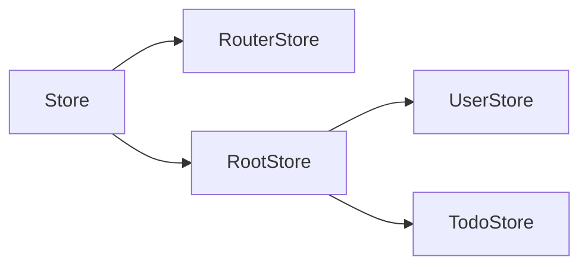

# EdTech Reporter Prototype

- bootstrapped with create-react-app typescript

## Tests

### Unit

`yarn test`

### E2E

`yarn cypress open`

### Store Construction

```mermaid
graph LR
Store
RouterStore
RootStore
RootStore-->UserStore
RootStore-->TodoStore
UserStore
TodoStore

Store-->RouterStore
Store-->RootStore
```
